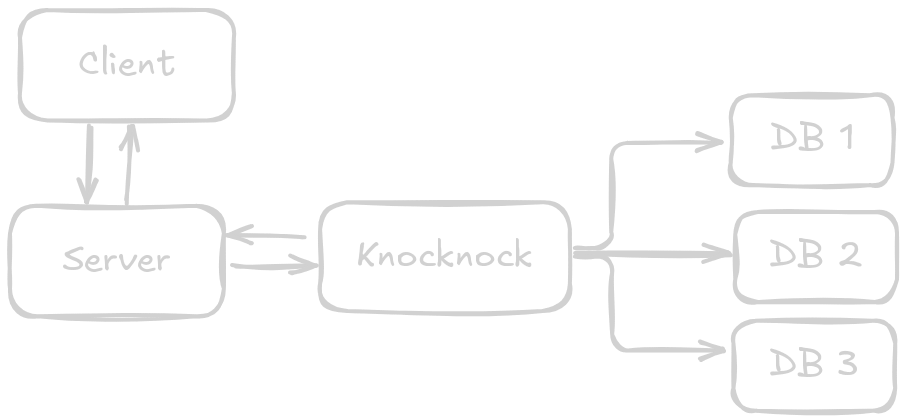

# 🔐 Knocknock


> &mdash; Knock-knock! <br />
> &mdash; Who is there? <br />
> &mdash; It's me, 66edb97812a98837aca048b3b2b180659ea55bcb4802de60f4aee484dda6a3ff

**Knocknock** &mdash; это легковесная простая библиотека для аутентификации и управления сессиями на Go. Она предоставляет простой API для создания, проверки и удаления сессий с поддержкой различных хранилищ и HTTP middleware.



## 🚀 Особенности

- **Простой API**: Достаточно лишь создать структуру Auth и вперёд!
- **Множественные источники токенов**: Поддержка cookies, HTTP-заголовков и query-параметров. Инкапсулирована в одном модуле
- **Расширяемое хранилище**: Интерфейс для подключения любых бэкендов через интерфейс Store. Из коробки реализовано in-memory хранилище
- **Готовый HTTP middleware**: Встроенная поддержка для интеграции с веб-приложениями

## 📦 Установка

```sh
go get -u github.com/tolstovrob/knocknock
```

## 🛠️ Быстрый старт

Более подробные примеры использования можно найти в `examples/`. Проект документирован, поэтому для API Reference можно использовать:

```sh
go doc -http
```

### Базовая настройка

```go
package main

import (
    "net/http"
    "time"
    
    "github.com/tolstovrob/knocknock"
)

func main() {
    // Создаём in-memory хранилище. Замените на любую реализацию Store
    store := knocknock.HandleMemoryStore()
    
    // Создаём менеджер аутентификации Auth с настройками
    auth := knocknock.HandleAuth(store,
        knocknock.WithDefaultExpiry(24 * time.Hour),
        knocknock.WithCookieName("auth_token"),
    )
    
    // Настраиваем роутер
    mux := http.NewServeMux()
    mux.HandleFunc("/login", loginHandler)
    mux.HandleFunc("/profile", profileHandler)
    
    // Добавляем middleware аутентификации
    handler := auth.Middleware()(mux)
    
    http.ListenAndServe(":8080", handler)
}
```

### Создание сессии

```go
type User struct {
    ID       int    `json:"id"`
    Username string `json:"username"`
    Email    string `json:"email"`
}

func loginHandler(w http.ResponseWriter, r *http.Request) {
    user := User{
        ID:       1,
        Username: "testuser",
        Email:    "test@example.com",
    }
    
    session, err := auth.CreateSession(r.Context(), user)
    if err != nil {
        http.Error(w, "Failed to create session", http.StatusInternalServerError)
        return
    }
    
    // Устанавливаем cookie для удобной работы с SPA.
    // На фронтенде достаточно лишь прокинуть соответствующий HTTP-заголовок
    http.SetCookie(w, &http.Cookie{
        Name:     auth.AuthOptions.CookieName,
        Value:    session.Token,
        Expires:  session.ExpiresAt,
        HttpOnly: true,
        Path:     "/",
    })
    
    w.WriteHeader(http.StatusOK)
    fmt.Fprintf(w, "Logged in successfully")
}
```

### Защищенные маршруты

```go
func profileHandler(w http.ResponseWriter, r *http.Request) {
    session := knocknock.GetSession(r.Context())
    if session == nil {
        http.Error(w, "Unauthorized", http.StatusUnauthorized)
        return
    }
    
    user, ok := session.UserData.(User)
    if !ok {
        http.Error(w, "Invalid session data", http.StatusInternalServerError)
        return
    }
    
    // Работаем с данными пользователя
    json.NewEncoder(w).Encode(user)
}
```

## ⚙️ Конфигурация

### Опции аутентификации

```go
auth := knocknock.HandleAuth(store,
    knocknock.WithTokenSize(64),                // Длина токена в байтах
    knocknock.WithDefaultExpiry(2 * time.Hour), // Время жизни сессии
    knocknock.WithCookieName("session"),        // Имя cookie
    knocknock.WithHeaderName("X-Auth-Token"),   // Имя HTTP-заголовка
    knocknock.WithQueryParamName("auth"),       // Имя query-параметра
)
```

### Обновление конфигурации

```go
auth.UpdateAuthOptions(
    knocknock.WithDefaultExpiry(30 * time.Minute),
    knocknock.WithTokenSize(48),
)
```

## 💾 Хранилища

### In-Memory хранилище (для разработки)

```go
store := knocknock.HandleMemoryStore()

// Очистка просроченных сессий (можно запускать в горутине)
go func() {
    for {
        time.Sleep(time.Hour)
        store.Cleanup()
    }
}()
```

### Кастомное хранилище

Реализуйте интерфейс `Store` для подключения Вашего хранилища:

```go
type Store interface {
    Save(ctx context.Context, session *Session) error
    Get(ctx context.Context, token string) (*Session, error)
    Delete(ctx context.Context, token string) error
}
```

## 🔧 API Reference

### Основные методы

- `CreateSession(ctx, userData)` - Создает новую сессию
- `GetSession(ctx, token)` - Получает сессию по токену
- `DeleteSession(ctx, token)` - Удаляет сессию
- `Middleware()` - HTTP middleware для проверки аутентификации

### Утилиты

- `GetSession(ctx)` - Получает сессию из контекста запроса
- `MakeSession(token, userData, expiresIn)` - Создает объект сессии
